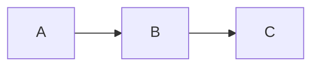

# Astro 個人ブログテンプレート

[English](README.md) | [한국어](README.ko.md) | [日本語](README.ja.md)

> 編集するのは `config/`、`content/`、`public/images/` の3か所だけです。

Markdownの投稿、プロジェクト、検索、RSS、sitemap、SEOメタデータ、ダークモード、
GitHub Pagesへのデプロイに対応した、設定ファイル駆動のAstroブログです。短い
サンプルコンテンツが含まれており、AstroやTypeScriptのファイルを編集せずに
ビルドできます。

## プレビュー

### ダークモード

**投稿一覧**


**Markdown投稿**


### ライトモード

**投稿一覧**


**Markdown投稿**


## 編集する場所

| パス | 用途 |
| --- | --- |
| `config/` | サイト情報、プロフィール、ナビゲーション、カテゴリーグループ、ソーシャルリンク、言語、機能の設定 |
| `content/` | Markdownの投稿・プロジェクトとそれぞれの専用画像 |
| `public/images/` | プロフィール、favicon、manifest、デフォルトのソーシャル画像 |

通常は `astro.config.mjs`、`package.json`、`src/`、
`src/content.config.ts`、`.github/workflows/deploy.yml`を編集する必要はありません。

## 主な機能

- レスポンシブレイアウトとダークモードを備えたAstro静的サイト
- カテゴリー、タグ、下書き、数式、Mermaidダイアグラム、コードハイライトに対応したMarkdown投稿
- Pagefind検索、アーカイブ、ページネーション、RSS、sitemap、robots.txt
- Canonical URL、Open Graph、Twitter Card、JSON-LD
- 任意で有効化できるプロジェクト一覧と詳細ページ
- 任意で有効化できるGiscusコメントと公開Analytics連携
- 設定可能な言語メタデータと翻訳投稿ルート
- Pull Requestでの検証とGitHub Pagesへの自動デプロイ

## このテンプレートを使う

1. GitHubで **Use this template → Create a new repository** を選択します。
2. 任意のリポジトリ名を指定します。`<your-username>.github.io`リポジトリは
   ドメインのルートに、それ以外の名前はリポジトリ名のパス配下にデプロイされます。
3. 新しいリポジトリをcloneします。
4. `config/`のサンプル値と`public/images/`の画像を置き換えます。
5. `content/`のサンプルファイルを置き換えるか削除します。
6. **Settings → Pages → Build and deployment** で **Source** を
   **GitHub Actions** に設定します。
7. `main`へpushすると、同梱のworkflowがサイトを検証してデプロイします。

## 動作要件とローカル開発

- Node.js 24以降
- npm

```bash
nvm use
npm ci
npx playwright install --only-shell chromium
npm run dev
```

`http://localhost:4321`を開きます。Pushする前に、CIと同じ検証を実行します。

```bash
npm run check
```

## サイト設定

次のファイルを順番に編集します。

1. `config/site.yaml` — タイトル、公開URL、locale、著者、画像、任意の公開連携ID
2. `config/navigation.yaml` — header、sidebar、footerのリンク
3. `config/categories.yaml` — sidebarのカテゴリーグループ、順序、非表示設定
4. `config/social.yaml` — GitHub、LinkedIn、X、Facebook、メールのリンク
5. `config/features.yaml` — 検索、RSS、sitemap、ダークモード、目次、Mermaid、プロジェクト、コメント
6. `config/profile.md` — Aboutページのタイトルと紹介文

空の任意ソーシャル・連携項目は画面に表示されません。`requiresFeature`を持つ
ナビゲーション項目は、対応する機能が無効な場合に非表示になります。各項目の
簡単な説明は`config/README.md`を参照してください。

`site.url`には最終的な公開URLを指定してください。

```yaml
site:
  url: https://username.github.io/my-blog
```

ユーザーサイトでは`https://username.github.io`、プロジェクトサイトでは完全な
`https://username.github.io/repository-name`、カスタムドメインでは
`https://example.com`を使用します。パスはリンク、asset、RSS、sitemap、
canonical URL、web manifestに自動で反映されます。末尾に`/`を付けないでください。

## 投稿を書く

次のパス配下に投稿を作成します。

```text
content/posts/<ordered-group>/<category>/<slug>/index.md
```

デフォルト言語では`index.md`を使用します。翻訳は同じフォルダー内で、設定した
言語コードに合わせて`ko.md`や`ja.md`のような名前を使用します。

```md
---
title: My first post
slug: my-first-post
description: A short summary for lists and search.
publishedAt: '2026-01-20'
categories: notes
tags:
  - Astro
draft: false
math: false
---

Write your post in Markdown.
```

本番環境から投稿を除外するには`draft: true`を設定します。投稿専用の画像は
Markdownファイルと同じ場所に置き、`./image.png`で参照します。最初のローカル
画像が自動的にcoverとして使われます。`cover: ./cover.png`のように明示することも
できます。

対話式の作成ヘルパーを使うと、正しいフォルダーに下書きを作成できます。

```bash
npm run new
```

コンテンツフォルダーはソースファイルを整理するためだけに使われます。Sidebarの
グループと順序は`config/categories.yaml`で設定します。`groups`と`hidden`の
どちらにも含まれないカテゴリーは、自動的に最後のグループへ表示され、
`npm run check`の結果にも出力されます。`hidden`はカテゴリーをsidebarからのみ
非表示にします。

同梱の`getting-started`サンプルでは、画像、コード、数式、内部・外部リンク、
タグ、下書きの使い方を確認できます。

ダイアグラムは通常の`mermaid` fenced code blockで記述します。ダイアグラム右上の
コードアイコン（`</>`）を押すと、画面中央のモーダルでソースの確認とコピーができます。

````md

````

## プロジェクトを追加する

`content/projects/<project-slug>/index.md`を作成します。フォルダー名がURLになります。

```md
---
title: Example Project
description: A short project summary.
repository: https://github.com/username/example-project
demo: https://example.com
image: ./cover.png
tags:
  - Astro
featured: true
order: 1
draft: false
---

Write the longer project description here.


```

`repository`、`demo`、`image`は任意です。おすすめプロジェクトが先に表示され、
その後は`order`の値が小さい順に表示されます。カバー画像と本文画像は
`index.md`と同じプロジェクトフォルダーに置きます。既存のプロジェクトURLを
維持するため、`content/projects/<project-slug>.md`形式も引き続きサポートします。
`config/features.yaml`で`projects: false`を設定すると、メニュー、一覧、詳細ルートが
まとめて非表示になります。

## 画像を置き換える

- `public/images/profile/` — Aboutのプロフィール画像
- `public/images/site/favicon.png` — faviconとmanifestアイコン
- `public/images/site/template-preview.png` — デフォルトのソーシャルプレビュー画像

`config/site.yaml`のパスと実際のファイル名を一致させてください。設定した画像が
存在しない場合は、該当する項目名とともにビルドが失敗します。投稿とプロジェクト専用の
画像は`public/images/`ではなく、対象のMarkdownファイルと同じ場所に置きます。

## GitHub Pagesへのデプロイ

同梱のworkflowは、Pull Request、`main`へのpush、手動実行時に動作します。
Pull Requestでは読み取り専用権限で、デプロイせずにすべてのチェックを実行します。
Pushと手動実行ではPagesが有効かどうかを確認します。Pagesが無効な場合はデプロイを
正常にスキップし、有効な場合は`dist/`をアップロードしてデプロイします。
`pages: write`と`id-token: write`はデプロイjobにだけ付与されます。

Pages Sourceを **GitHub Actions** に設定した後は、workflowを編集する必要は
ありません。すべての外部Action参照は完全なcommit SHAに固定されています。

## カスタムドメイン

1. `config/site.yaml`の`site.url`をHTTPSのカスタムドメインに変更してpushします。
2. **Settings → Pages → Custom domain** に同じドメインを追加します。
3. GitHubに表示されるDNS recordを設定します。Subdomainでは通常
   `<username>.github.io`を指す`CNAME`を使います。Apex domainではGitHubの
   `A`/`AAAA` record、またはDNSプロバイダーが対応する`ALIAS`/`ANAME`を使います。
4. アカウント単位でドメインを検証し、DNSの反映を待ってから **Enforce HTTPS** を
   有効にします。Wildcard DNS recordは避けてください。

同梱のGitHub Actionsデプロイでは`CNAME`ファイルは不要です。最新のDNS値と
セキュリティガイドについては、[GitHub Pagesカスタムドメイン公式ガイド](https://docs.github.com/en/pages/configuring-a-custom-domain-for-your-github-pages-site/managing-a-custom-domain-for-your-github-pages-site)を
参照してください。

## トラブルシューティング

- YAMLエラー：インデントと、エラーメッセージに表示されたファイル・項目を確認してください。
- 不正な`site.url`：`https://`を含む完全な公開URLを入力してください。
- `public asset does not exist`：設定したパスを実際のファイルに合わせてください。
- 不正な投稿日時：`publishedAt: 'YYYY-MM-DD'`形式を使用してください。
- slugの重複：同じ言語の各投稿に固有のslugを使用してください。
- プロジェクトURLエラー：`repository`と`demo`にはHTTPまたはHTTPS URLを使用してください。
- コメント設定エラー：`comments: false`を設定するか、`config/site.yaml`に公開Giscus
  設定をすべて入力してください。

修正後に`npm run check`をもう一度実行してください。

## シークレット

API token、password、private keyなどの秘密情報を、`config/`、Markdown、commitする
環境ファイルに保存しないでください。Analytics measurement ID、サイト検証文字列、
Giscusのリポジトリ・カテゴリーIDはブラウザーに公開される設定です。将来の自動化で
秘密情報が必要になった場合は、GitHub Actions Secretsと環境変数を使用してください。

## 高度なカスタマイズ

テーマの実装を変更する場合にのみ、`src/`、Astro設定、package script、デプロイ
workflowを編集します。通常のカスタマイズが3つのユーザー編集領域で完結するよう、
これらのファイルは意図的に内部領域として分離されています。

## ライセンス

このテンプレートは[MIT License](./LICENSE)の下で提供されます。

Copyright (c) 2026 noir1458.
