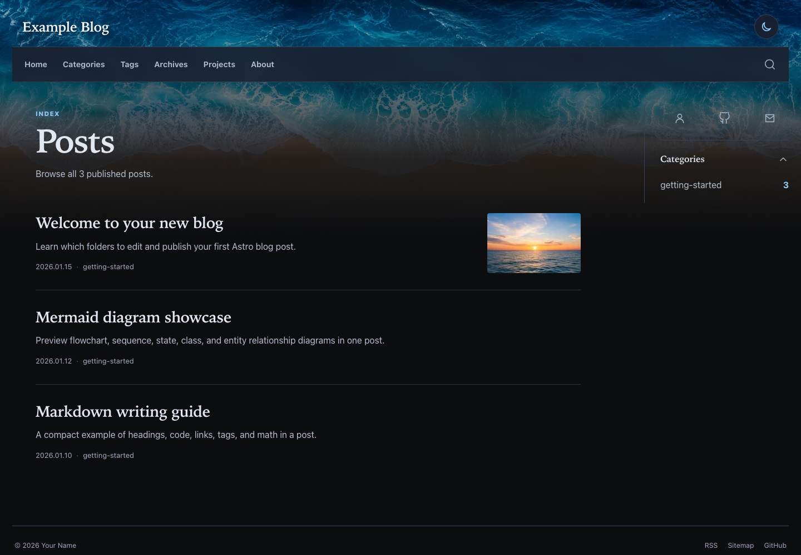
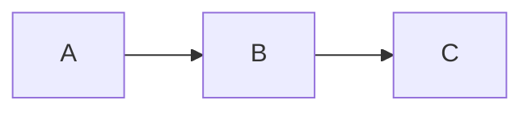

# Astro 개인 블로그 템플릿

[English](README.md) | [한국어](README.ko.md) | [日本語](README.ja.md)

> `config/`, `content/`, `public/images/`만 수정하면 됩니다.

Markdown 게시물, 프로젝트, 검색, RSS, sitemap, SEO 메타데이터, 다크 모드와
GitHub Pages 배포를 지원하는 설정 기반 Astro 블로그입니다. 짧은 예제 콘텐츠가
포함되어 있으며 Astro 또는 TypeScript 파일을 수정하지 않아도 빌드할 수 있습니다.



## 수정할 영역

| 경로 | 용도 |
| --- | --- |
| `config/` | 사이트 정보, 프로필, 탐색 메뉴, 카테고리 그룹, 소셜 링크, 언어와 기능 설정 |
| `content/` | Markdown 게시물, 게시물 이미지와 프로젝트 Markdown |
| `public/images/` | 프로필, 프로젝트, favicon, manifest와 기본 소셜 이미지 |

대부분의 사용자는 `astro.config.mjs`, `package.json`, `src/`,
`src/content.config.ts`, `.github/workflows/deploy.yml`을 수정할 필요가 없습니다.

## 주요 기능

- 반응형 레이아웃과 다크 모드를 제공하는 Astro 정적 사이트
- 카테고리, 태그, 초안, 수식, Mermaid 다이어그램과 코드 하이라이팅을 지원하는 Markdown 게시물
- Pagefind 검색, 아카이브, 페이지네이션, RSS, sitemap과 robots.txt
- Canonical URL, Open Graph, Twitter Card와 JSON-LD
- 선택적으로 사용할 수 있는 프로젝트 목록과 상세 페이지
- 선택적으로 사용할 수 있는 Giscus 댓글과 공개 Analytics 연동
- 설정 가능한 언어 메타데이터와 번역 게시물 경로
- Pull Request 검증과 GitHub Pages 자동 배포

## 이 템플릿 사용하기

1. GitHub에서 **Use this template → Create a new repository**를 선택합니다.
2. 원하는 저장소 이름을 사용합니다. `<your-username>.github.io` 저장소는 루트
   도메인에 배포되고, 그 외 이름은 저장소 이름 경로 아래에 배포됩니다.
3. 새 저장소를 clone합니다.
4. `config/`의 예제 값과 `public/images/`의 이미지를 교체합니다.
5. `content/`의 예제 파일을 교체하거나 삭제합니다.
6. **Settings → Pages → Build and deployment**에서 **Source**를
   **GitHub Actions**로 설정합니다.
7. `main`에 push하면 포함된 workflow가 사이트를 검증하고 배포합니다.

## 요구 환경과 로컬 실행

- Node.js 24 이상
- npm

```bash
nvm use
npm ci
npx playwright install --only-shell chromium
npm run dev
```

`http://localhost:4321`을 엽니다. Push하기 전 CI와 같은 검증을 실행합니다.

```bash
npm run check
```

## 사이트 설정

다음 파일을 순서대로 수정합니다.

1. `config/site.yaml` — 제목, 공개 URL, locale, 작성자, 이미지와 선택적 공개 연동 식별자
2. `config/navigation.yaml` — header, sidebar와 footer 링크
3. `config/categories.yaml` — sidebar 카테고리 그룹, 순서와 숨김 설정
4. `config/social.yaml` — GitHub, LinkedIn, 이메일과 이력서 링크
5. `config/features.yaml` — 검색, RSS, sitemap, 다크 모드, 목차, Mermaid, 프로젝트와 댓글
6. `config/profile.md` — About 페이지 제목과 소개

비어 있는 선택적 소셜 및 연동 값은 화면에 표시되지 않습니다. `requiresFeature`가
있는 탐색 항목은 관련 기능이 꺼져 있으면 숨겨집니다. 간단한 필드 설명은
`config/README.md`에서 확인할 수 있습니다.

`site.url`에는 최종 공개 주소를 입력해야 합니다.

```yaml
site:
  url: https://username.github.io/my-blog
```

사용자 사이트는 `https://username.github.io`, 프로젝트 사이트는 전체 주소인
`https://username.github.io/repository-name`, 커스텀 도메인은
`https://example.com` 형식을 사용합니다. 경로는 링크, asset, RSS, sitemap,
canonical URL과 web manifest에 자동으로 적용됩니다. 마지막에 `/`를 붙이지 마세요.

## 게시물 작성

다음 경로 아래에 게시물을 만듭니다.

```text
content/posts/<ordered-group>/<category>/<slug>/index.md
```

기본 언어는 `index.md`를 사용합니다. 번역본은 같은 폴더에서 설정된 언어 코드에
따라 `ko.md`, `ja.md` 같은 이름을 사용합니다.

```md
---
title: My first post
slug: my-first-post
description: A short summary for lists and search.
publishedAt: '2026-01-20'
categories: notes
tags:
  - Astro
draft: false
math: false
---

Write your post in Markdown.
```

게시물을 배포에서 제외하려면 `draft: true`로 설정합니다. 게시물 전용 이미지는
Markdown 파일 옆에 두고 `./image.png`로 참조합니다. 첫 번째 로컬 이미지가
자동으로 cover가 되며, `cover: ./cover.png`처럼 직접 지정할 수도 있습니다.

대화형 작성 도우미를 사용하면 올바른 폴더에 초안을 만들 수 있습니다.

```bash
npm run new
```

콘텐츠 폴더는 소스 파일을 정리하는 용도로만 사용됩니다. Sidebar 그룹과 순서는
`config/categories.yaml`에서 설정합니다. `groups`와 `hidden` 어디에도 없는
카테고리는 자동으로 마지막 그룹에 표시되며 `npm run check` 결과에도 나옵니다.
`hidden`은 해당 카테고리를 sidebar에서만 숨깁니다.

포함된 `getting-started` 예제는 이미지, 코드, 수식, 내부·외부 링크, 태그와 초안
사용법을 보여줍니다.

다이어그램은 일반 `mermaid` fenced code block으로 작성합니다. 다이어그램 우측
상단의 코드 아이콘(`</>`)을 누르면 화면 중앙의 모달에서 원문을 확인하고 복사할 수 있습니다.

````md

````

## 프로젝트 추가

`content/projects/<project-slug>.md`를 만듭니다. 파일명이 URL이 됩니다.

```md
---
title: Example Project
description: A short project summary.
repository: https://github.com/username/example-project
demo: https://example.com
image: /images/projects/example-project.svg
tags:
  - Astro
featured: true
order: 1
draft: false
---

Write the longer project description here.
```

`repository`, `demo`, `image`는 선택 항목입니다. 추천 프로젝트가 먼저 표시되고,
그다음 `order` 값이 작은 순서대로 표시됩니다. `config/features.yaml`에서
`projects: false`로 설정하면 메뉴, 목록과 상세 경로가 함께 숨겨집니다.

## 이미지 교체

- `public/images/profile/` — About 프로필 이미지
- `public/images/projects/` — 프로젝트 카드와 상세 이미지
- `public/images/site/favicon.png` — favicon과 manifest 아이콘
- `public/images/site/template-preview.png` — 기본 소셜 미리보기 이미지

`config/site.yaml`의 경로와 실제 파일명을 일치시키세요. 설정된 이미지가 없으면
정확한 필드명과 함께 빌드가 실패합니다. 게시물 전용 이미지는 `public/images/`가
아니라 해당 Markdown 파일 옆에 둡니다.

## GitHub Pages 배포

포함된 workflow는 Pull Request, `main` push와 수동 실행 시 동작합니다. Pull
Request에서는 읽기 전용 권한으로 배포 없이 전체 검사를 실행합니다. Push와 수동
실행에서는 Pages 활성화 여부를 확인합니다. Pages가 꺼져 있으면 배포 단계를
정상적으로 건너뛰고, 켜져 있으면 `dist/`를 업로드해 배포합니다. `pages: write`와
`id-token: write` 권한은 배포 job에만 부여됩니다.

Pages Source를 **GitHub Actions**로 설정한 뒤에는 workflow를 수정할 필요가
없습니다. 모든 외부 Action 참조는 전체 commit SHA로 고정되어 있습니다.

## 커스텀 도메인

1. `config/site.yaml`의 `site.url`을 HTTPS 커스텀 도메인으로 바꾸고 push합니다.
2. **Settings → Pages → Custom domain**에 같은 도메인을 추가합니다.
3. GitHub에서 안내하는 DNS record를 설정합니다. Subdomain은 일반적으로
   `<username>.github.io`를 가리키는 `CNAME`을 사용합니다. Apex domain은
   GitHub의 `A`/`AAAA` record 또는 DNS 제공자가 지원하는 `ALIAS`/`ANAME`을
   사용합니다.
4. 계정 수준에서 도메인을 인증하고 DNS 전파를 기다린 뒤 **Enforce HTTPS**를
   활성화합니다. Wildcard DNS record는 사용하지 않는 것이 좋습니다.

포함된 GitHub Actions 배포에는 `CNAME` 파일이 필요하지 않습니다. 최신 DNS 값과
보안 지침은 [GitHub Pages 커스텀 도메인 공식 안내](https://docs.github.com/en/pages/configuring-a-custom-domain-for-your-github-pages-site/managing-a-custom-domain-for-your-github-pages-site)를
참고하세요.

## 문제 해결

- YAML 오류: 들여쓰기와 오류 메시지에 표시된 파일·필드를 확인하세요.
- 잘못된 `site.url`: `https://`와 전체 공개 주소를 입력하세요.
- `public asset does not exist`: 설정 경로를 실제 파일과 일치시키세요.
- 잘못된 게시물 날짜: `publishedAt: 'YYYY-MM-DD'` 형식을 사용하세요.
- 중복 slug: 같은 언어의 게시물마다 고유한 slug를 사용하세요.
- 프로젝트 URL 오류: `repository`와 `demo`는 HTTP 또는 HTTPS 주소여야 합니다.
- 댓글 설정 오류: `comments: false`로 설정하거나 `config/site.yaml`에 공개 Giscus
  설정을 모두 입력하세요.

오류를 수정한 뒤 `npm run check`를 다시 실행하세요.

## 비밀값

API token, password, private key 등의 비밀값을 `config/`, Markdown 또는 commit되는
환경 파일에 넣지 마세요. Analytics measurement ID, 사이트 인증 문자열과 Giscus
저장소·카테고리 ID는 브라우저에 공개되는 설정입니다. 이후 자동화에 비밀값이
필요하다면 GitHub Actions Secrets와 환경변수를 사용하세요.

## 고급 사용자 설정

테마 구현을 변경하는 사용자만 `src/`, Astro 설정, package script 또는 배포
workflow를 수정하면 됩니다. 일반적인 설정이 세 사용자 편집 영역 안에서
끝나도록 이 파일들은 의도적으로 내부 영역에 두었습니다.

## 라이선스

이 템플릿은 [MIT License](./LICENSE)로 제공됩니다.

Copyright (c) 2026 noir1458.
