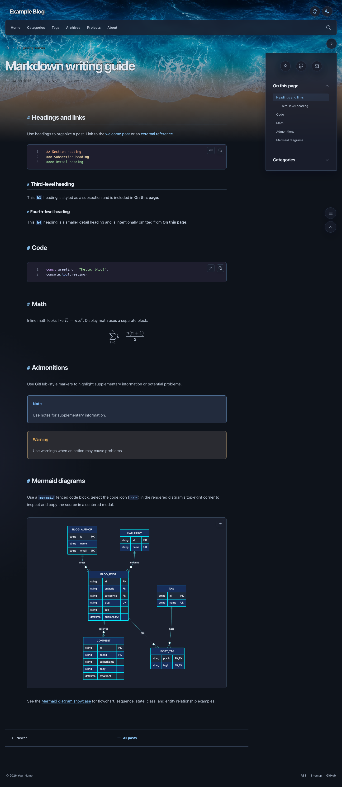
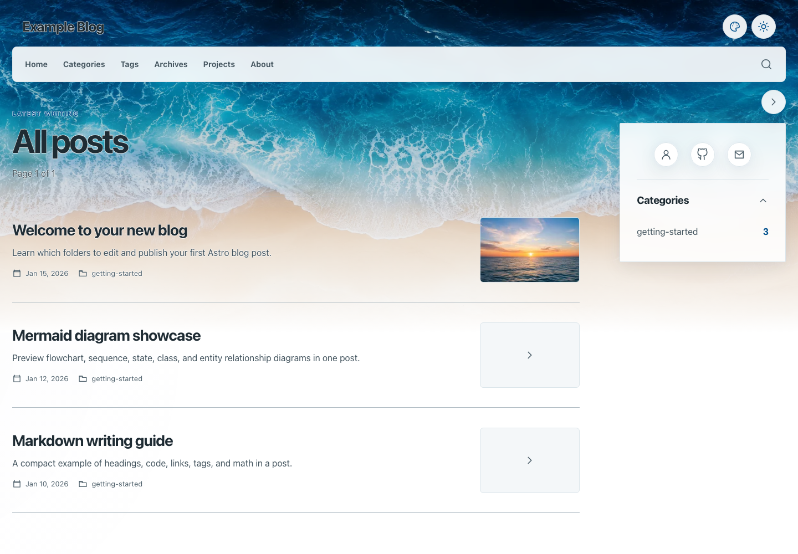
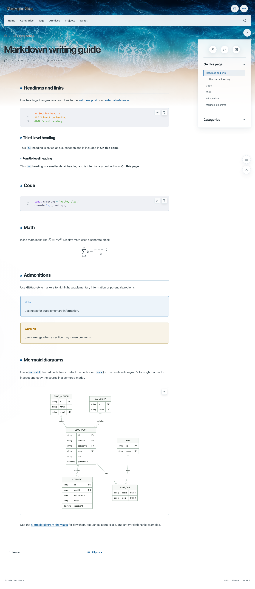
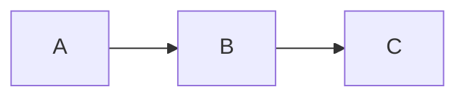

# Astro Blog & Portfolio Template

[](https://github.com/noir1458/astro_blog_template/actions/workflows/deploy.yml)
[](https://astro.build/)
[](LICENSE)

[English](README.md) | [한국어](README.ko.md) | [日本語](README.ja.md)

> You only need to edit `config/`, `content/`, and `public/images/`.

A configuration-first Astro blog and portfolio template that deploys directly to
GitHub Pages. It includes Markdown posts, projects, search, RSS, sitemap, SEO
metadata, dark mode, and short example content, and builds without editing Astro
or TypeScript files.

[**Live Demo**](https://noir1458.github.io/astro_blog_template/) ·
[**Use this template**](https://github.com/noir1458/astro_blog_template/generate)

The live demo and starter both showcase the included site-wide background
banner. Replace its image for your site, or disable it with one setting.

## Preview

### Dark

**Post list**


**Markdown post**



### Light

**Post list**



**Markdown post**



## What you edit

| Path | Purpose |
| --- | --- |
| `config/` | Site identity, profile, navigation, category groups, social links, languages, and features |
| `content/` | Markdown posts and projects with their local images |
| `public/images/` | Profile, favicon, manifest, and default social images |

Most users do not need to edit `astro.config.mjs`, `package.json`, `src/`,
`src/content.config.ts`, or `.github/workflows/deploy.yml`.

## Features

- Static Astro site with responsive layout and dark mode
- Markdown posts with categories, tags, drafts, math, admonitions, Mermaid diagrams, and code highlighting
- Pagefind search, archives, pagination, RSS, sitemap, and robots.txt
- Canonical URLs, Open Graph, Twitter cards, and JSON-LD
- Optional project list and project detail pages
- Optional Giscus comments and public analytics integrations
- Configurable language metadata and translated post routes
- Pull-request validation and automatic GitHub Pages deployment

## Use this template

1. Select **Use this template → Create a new repository** on GitHub.
2. Choose any repository name. A `<your-username>.github.io` repository uses the
   domain root; any other name is deployed below that repository-name path.
3. Clone the new repository.
4. Replace the example values in `config/` and the images in `public/images/`.
5. Replace or remove the example files in `content/`.
6. In **Settings → Pages → Build and deployment**, set **Source** to
   **GitHub Actions**.
7. Push to `main`. The included workflow validates and deploys the site.

## Requirements and local development

- Node.js 24 or later
- npm

```bash
nvm use
npm ci
npx playwright install --only-shell chromium
npm run dev
```

Open `http://localhost:4321`. Before pushing, run the same validation used in CI:

```bash
npm run check
```

## Configure the site

Edit these files in order:

1. `config/site.yaml` — title, public URL, locale, author, images, and optional
   public integration identifiers
2. `config/navigation.yaml` — header, sidebar, and footer links
3. `config/categories.yaml` — sidebar category groups, order, and hidden categories
4. `config/social.yaml` — GitHub, LinkedIn, X, Facebook, and email links
5. `config/features.yaml` — search, RSS, sitemap, dark mode, table of contents,
   Mermaid diagrams, projects, and comments
6. `config/profile.md` — About page title and introduction

Empty optional social and integration values are hidden. A navigation item with
`requiresFeature` is hidden when its related feature is disabled. See
`config/README.md` for the short field guide.

`site.url` must be the final public origin, for example:

```yaml
site:
  url: https://username.github.io/my-blog
```

Use `https://username.github.io` for a user site, the full
`https://username.github.io/repository-name` URL for a project site, or
`https://example.com` for a custom domain. The path is applied to links, assets,
RSS, sitemap, canonical URLs, and the web manifest automatically. Do not add a
trailing slash.

Set the site's default accent hue from 0 through 360:

```yaml
appearance:
  accentHue: 248
```

The template derives saturation, lightness, and contrast for both light and dark
themes. Every visitor starts with this hue and can adjust it with the vertical
slider in the palette menu. Their personal hue is stored in their browser.

The included site-wide background banner is enabled by default. Replace its
local image under `public/`, or adjust it in `config/site.yaml`:

```yaml
appearance:
  banner:
    enabled: true
    image: /images/site/banner.webp
    position: center
    height: 600
    mobileHeight: 420
    overlayOpacity: 0.18
```

The image fills the viewport width behind the existing header and navigation on
every page rendered by the shared layout, then fades into the active light or
dark theme background. Project-site base paths are applied automatically. Set
`enabled: false` to remove the banner.

## Write posts

Create posts under:

```text
content/posts/<ordered-group>/<category>/<slug>/index.md
```

The default language uses `index.md`. A translation uses its configured language
code, such as `ko.md` or `ja.md`, in the same folder.

```md
---
title: My first post
slug: my-first-post
description: A short summary for lists and search.
publishedAt: '2026-01-20'
categories: notes
tags:
  - Astro
draft: false
math: false
---

Write your post in Markdown.
```

Set `draft: true` to keep a post out of production. Put post-specific images beside
the Markdown file and reference them with `./image.png`. The first local image is
used as the cover automatically, or set `cover: ./cover.png` explicitly.

The interactive authoring helper creates a draft in the correct folder:

```bash
npm run new
```

Content folders are only for organizing source files. Configure sidebar grouping
and order in `config/categories.yaml`. Categories omitted from both `groups` and
`hidden` remain visible in an automatic final group and are listed by
`npm run check`; `hidden` only removes them from the sidebar.

The included `getting-started` examples demonstrate an image, code, math, internal
and external links, tags, and drafts.

Use a regular `mermaid` fenced code block to add a diagram. Select the code icon (`</>`) in
the diagram's top-right corner to inspect and copy the source in a centered modal.

````md

````

## Add projects

Create `content/projects/<project-slug>/index.md`. The folder name becomes the URL.

```md
---
title: Example Project
description: A short project summary.
repository: https://github.com/username/example-project
demo: https://example.com
image: ./cover.png
tags:
  - Astro
featured: true
order: 1
draft: false
---

Write the longer project description here.


```

`repository`, `demo`, and `image` are optional. Featured projects appear first,
then lower `order` values. Keep the cover and body images beside `index.md` in the
same project folder. The legacy `content/projects/<project-slug>.md` layout remains
supported so existing project URLs do not change. Set `projects: false` in
`config/features.yaml` to hide the menu, list, and detail routes together.

## Replace images

- `public/images/profile/` — About profile image
- `public/images/site/favicon.png` — favicon and manifest icon
- `public/images/site/template-preview.png` — default social preview image

Keep `config/site.yaml` paths synchronized with the filenames. Missing configured
images fail the build with the exact field name. Post- and project-only images
belong beside their Markdown, not in `public/images/`.

## GitHub Pages deployment

The included workflow runs on pull requests, pushes to `main`, and manual runs.
Pull requests receive read-only permissions and run the complete check without
deploying. On pushes and manual runs, the workflow detects whether Pages is enabled.
It skips deployment successfully when Pages is off; when Pages is on, it uploads
`dist/` and deploys it. Only the deploy job receives `pages: write` and
`id-token: write`.

After setting Pages Source to **GitHub Actions**, no workflow editing is required.
All third-party action references are pinned to full commit SHAs.

## Custom domain

1. Change `config/site.yaml` `site.url` to the HTTPS custom domain and push.
2. Add the same domain in **Settings → Pages → Custom domain**.
3. Configure the DNS records GitHub shows. A subdomain normally uses a `CNAME` to
   `<username>.github.io`; an apex domain uses GitHub's `A`/`AAAA` records or an
   `ALIAS`/`ANAME` supported by the DNS provider.
4. Verify the domain at the account level, wait for DNS propagation, and enable
   **Enforce HTTPS**. Avoid wildcard DNS records.

A `CNAME` file is not required for the included GitHub Actions deployment. Follow
the [official GitHub Pages custom-domain guide](https://docs.github.com/en/pages/configuring-a-custom-domain-for-your-github-pages-site/managing-a-custom-domain-for-your-github-pages-site)
for current DNS values and security guidance.

## Troubleshooting

- YAML error: check indentation and the file/field named in the message.
- Invalid `site.url`: include `https://` and the complete public origin.
- `public asset does not exist`: make the configured path match the real file.
- Invalid post date: use `publishedAt: 'YYYY-MM-DD'`.
- Duplicate slug: use a unique slug for every post in the same language.
- Project URL error: `repository` and `demo` must use HTTP or HTTPS.
- Comments configuration error: either set `comments: false` or provide the full
  public Giscus configuration in `config/site.yaml`.

Run `npm run check` again after fixing the named value.

## Secrets

Do not put API tokens, passwords, private keys, or other secrets in `config/`,
Markdown, or committed environment files. Analytics measurement IDs, site
verification strings, and Giscus repository/category IDs are public browser
configuration. If future automation needs a secret, use GitHub Actions Secrets and
an environment variable.

## Advanced customization

Only users changing the theme's implementation need to edit `src/`, Astro config,
package scripts, or the deployment workflow. These files intentionally remain
internal so normal customization stays in the three user-facing areas.

## License

This template is available under the [MIT License](./LICENSE).

Copyright (c) 2026 noir1458.
