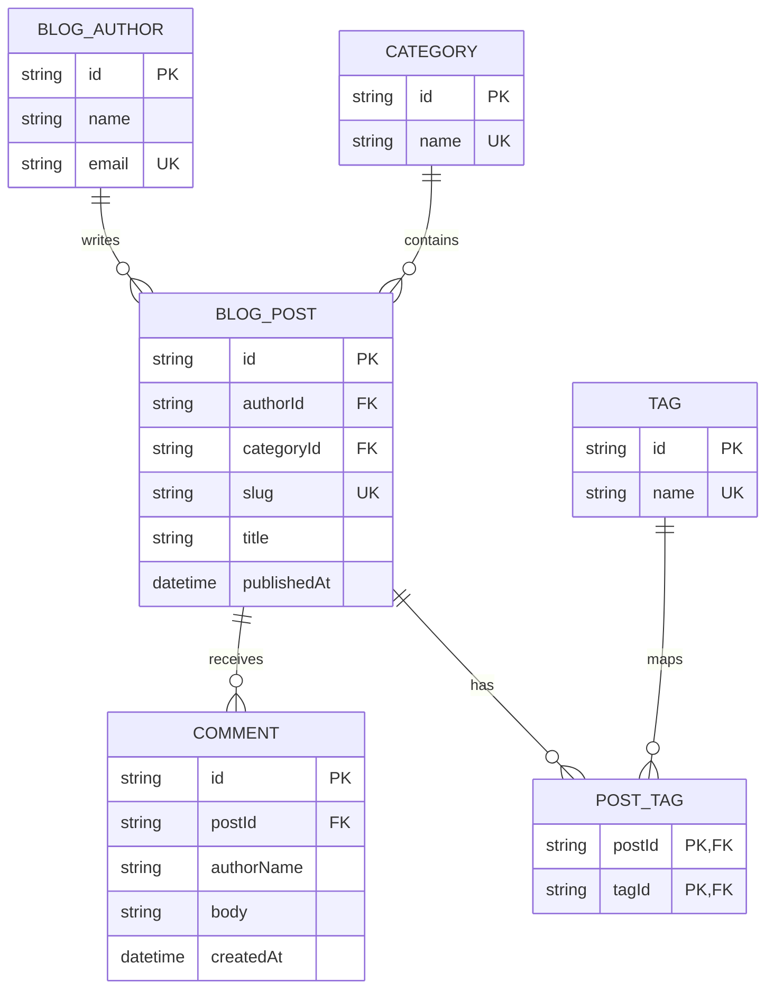

## Headings and links

Use headings to organize a post. Link to the [welcome post](/posts/welcome/) or an
[external reference](https://www.markdownguide.org/).

```md
## Section heading
### Subsection heading
#### Detail heading
```

### Third-level heading

This `h3` heading is styled as a subsection and is included in **On this page**.

#### Fourth-level heading

This `h4` heading is a smaller detail heading and is intentionally omitted from
**On this page**.

## Code

```js
const greeting = "Hello, blog!";
console.log(greeting);
```

## Math

Inline math looks like $E = mc^2$. Display math uses a separate block:

$$
\sum_{k=1}^{n} k = \frac{n(n+1)}{2}
$$

## Mermaid diagrams

Use a `mermaid` fenced code block. Select the code icon (`</>`) in the rendered diagram's
top-right corner to inspect and copy the source in a centered modal.



See the [Mermaid diagram showcase](/posts/mermaid-showcase/) for flowchart,
sequence, state, class, and entity relationship examples.
