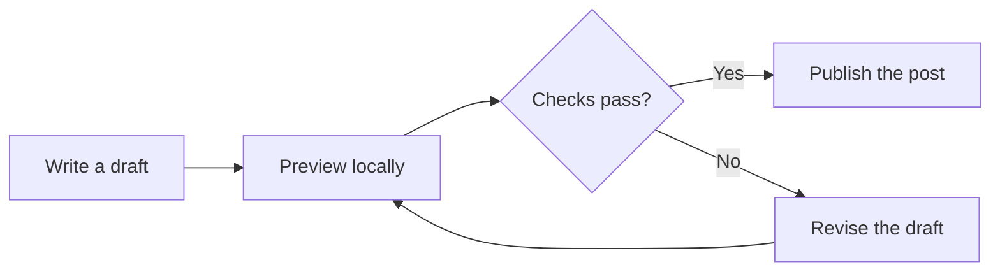
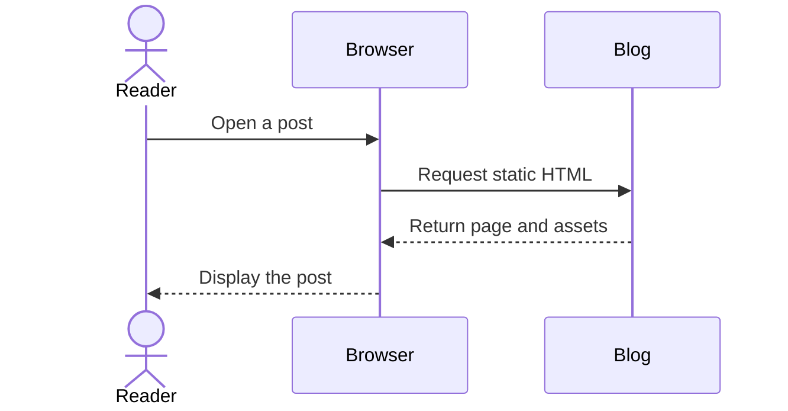
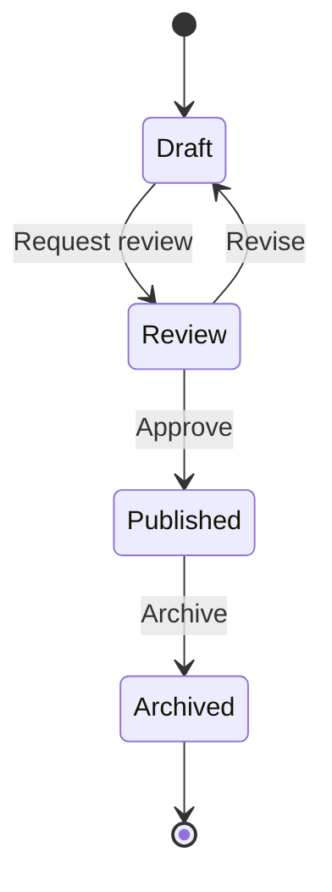
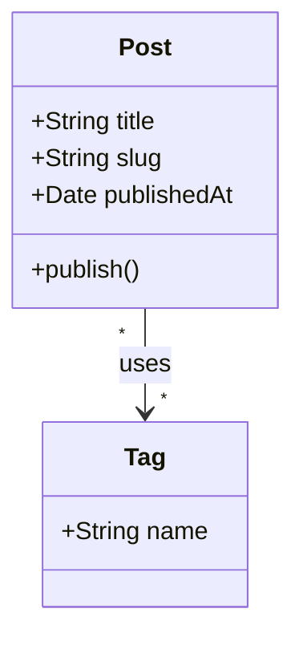
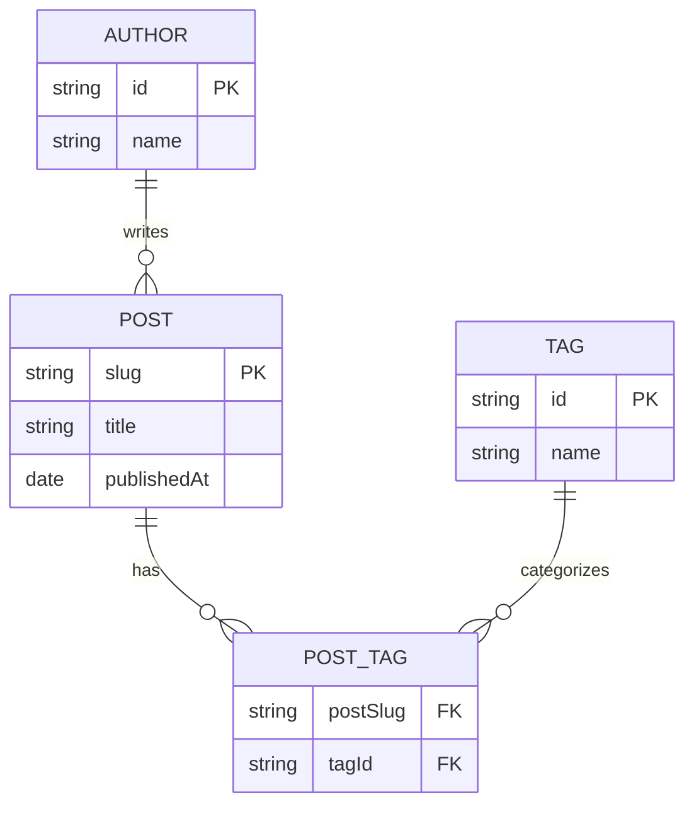

This post collects several Mermaid diagram types so you can check rendering,
source disclosure, copying, responsive layout, and dark mode in one place.

## Flowchart

A flowchart is useful for a publishing workflow or decision tree.

## Sequence diagram

A sequence diagram shows messages exchanged over time.

## State diagram

A state diagram works well for lifecycle documentation.

## Class diagram

A class diagram can document the shape of related content objects.

## Entity relationship diagram

An entity relationship diagram is useful for data models.

Try switching the site theme and narrowing the browser window. Each diagram
should remain readable, and its original source should be available underneath.
