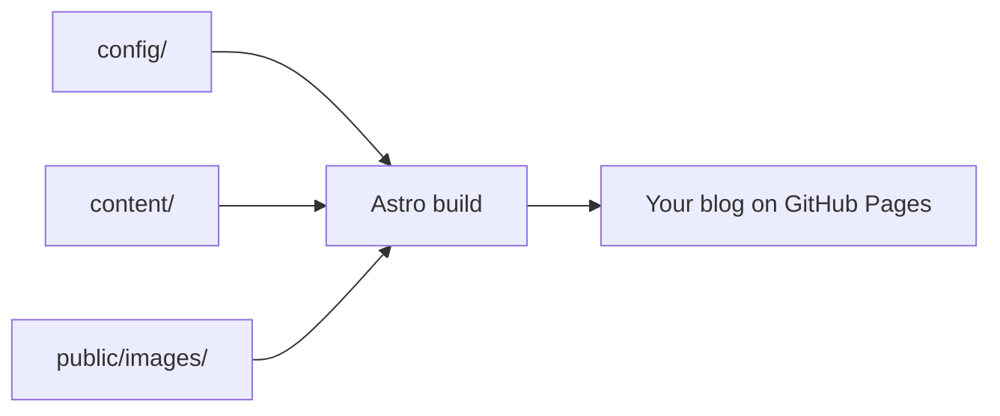

This starter keeps customization focused on three places: `config/`, `content/`,
and `public/images/`.

Continue with the [Markdown guide](/posts/markdown-guide/) or visit the
[Astro documentation](https://docs.astro.build/) for advanced customization.
